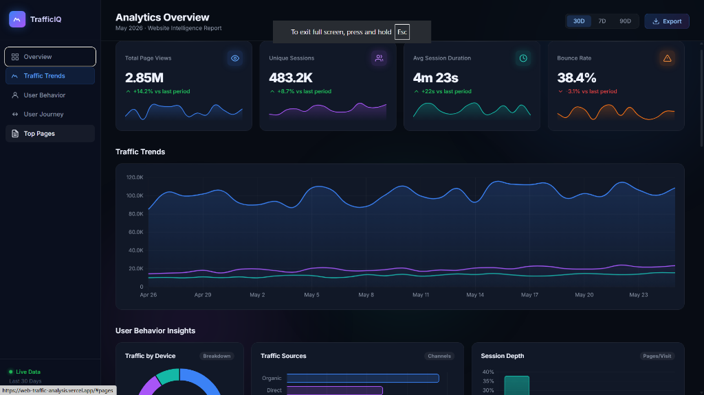
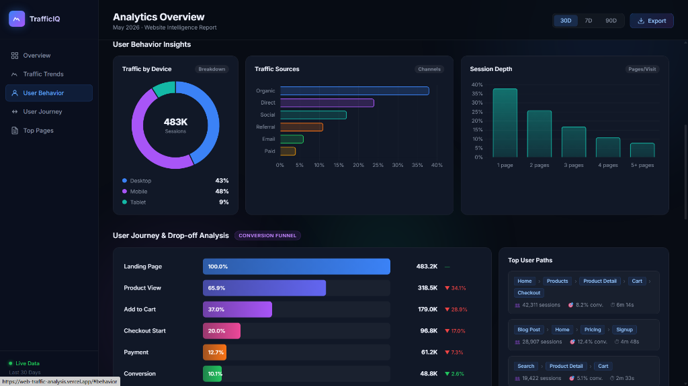
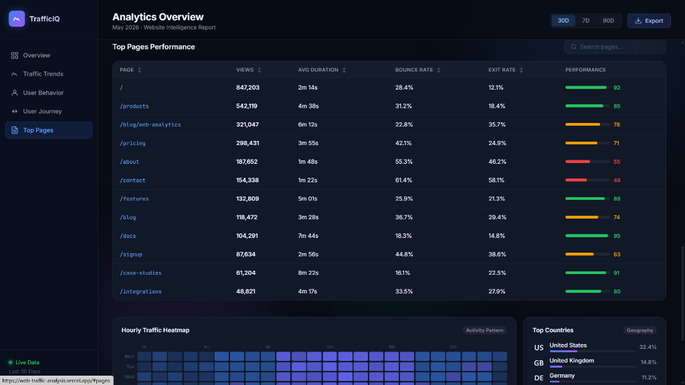
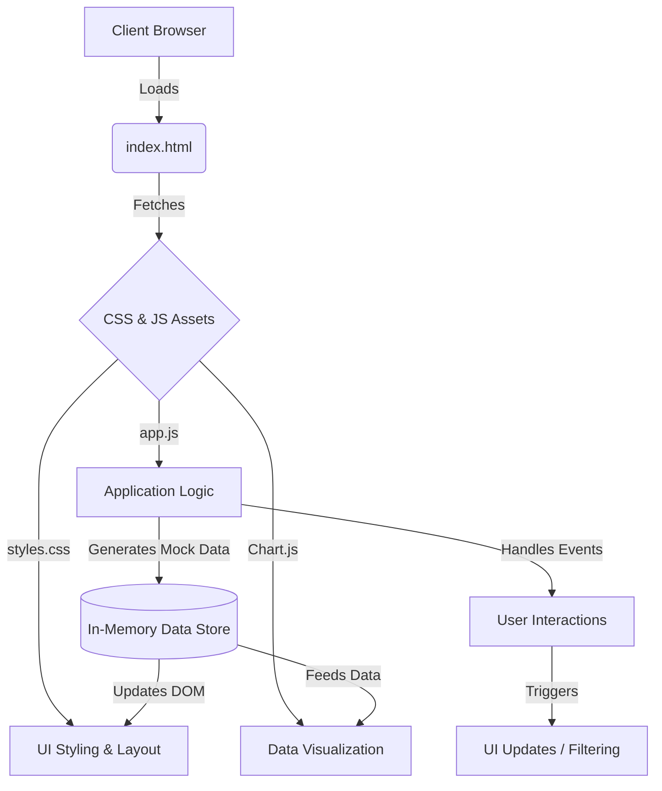

# TrafficIQ - Web Analytics Intelligence

<div align="center">
  
</div>

A stunning, modern, and highly interactive web traffic analytics dashboard built with raw HTML, CSS, and JavaScript. TrafficIQ visualizes key metrics, user behavior, and conversion funnels to provide actionable insights.

[](https://web-traffic-analysis.vercel.app/)

---

## 🌟 Features

*   **Zero Dependencies (except Chart.js):** Built primarily with vanilla web technologies for maximum performance and customization.
*   **Interactive Data Visualization:** Utilizes Chart.js for beautiful, responsive charts (line, doughnut, bar).
*   **Comprehensive Metrics:** Tracks Page Views, Unique Sessions, Session Duration, and Bounce Rate.
*   **Conversion Funnel Analysis:** Visualizes drop-off rates across key user journey stages.
*   **Geographic Insights:** Displays traffic distribution by country.
*   **Responsive Design:** Adapts fluidly to different screen sizes.
*   **Dark Glassmorphism UI:** A premium, modern aesthetic with animated background elements.

---

## 📸 Screenshots

### Analytics Overview

*The main dashboard view featuring KPI cards with sparklines and a detailed traffic trends chart.*

### User Behavior & Funnel Analysis

*Insights into device breakdown, traffic sources, and a visual conversion funnel.*

### Top Pages Performance

*A sortable and searchable table detailing performance metrics for individual pages.*

---

## 🏗️ Architecture & How It Works

TrafficIQ is designed as a single-page application (SPA) running entirely client-side. Here is a high-level overview of its architecture:



### 1. Structure (`index.html`)

The HTML file provides the skeletal structure of the dashboard. It uses semantic HTML5 tags (`<header>`, `<nav>`, `<main>`, `<section>`, `<aside>`) to ensure accessibility and maintainability. It also includes SVG icons directly inline for performance.

### 2. Styling (`styles.css`)

The CSS file implements a custom "dark glassmorphism" design system. Key techniques used include:

*   **CSS Variables:** For consistent theming (colors, spacing, typography).
*   **CSS Grid & Flexbox:** For responsive layouts across all sections.
*   **Backdrop Filter:** To create the frosted glass effect on the sidebar and header.
*   **CSS Animations & Transitions:** For smooth micro-interactions (e.g., hover states, the floating background orbs).

### 3. Logic & Visualization (`app.js`)

The JavaScript file acts as the controller for the application.

*   **Data Generation:** Since this is a frontend-only demo, `app.js` generates realistic synthetic data (e.g., `genSeries` function) upon initialization.
*   **Chart Initialization:** It uses Chart.js to render the various visualizations (Traffic Trends, Device Breakdown, etc.), applying custom gradients and styling to match the theme.
*   **DOM Manipulation:** It dynamically populates the UI elements like the Funnel, User Journey paths, and the Top Pages table based on the generated data.
*   **Interactivity:** It sets up event listeners for sorting the table, filtering pages, switching date periods, and handling smooth scrolling navigation.

---

## 🚀 Getting Started

To run TrafficIQ locally, follow these simple steps:

1.  **Clone the repository:**
    ```bash
    git clone https://github.com/yourusername/trafficiq.git
    cd trafficiq
    ```

2.  **Open `index.html`:**
    You can simply double-click the `index.html` file to open it in your browser. Alternatively, use a local development server for a better experience (e.g., using Python or an npm package like `serve`).

    ```bash
    # Using Python 3
    python -m http.server 8000
    # Then navigate to http://localhost:8000 in your browser
    ```

---

## 🛠️ Built With

*   [HTML5](https://developer.mozilla.org/en-US/docs/Web/Guide/HTML/HTML5) - Markup language
*   [CSS3](https://developer.mozilla.org/en-US/docs/Web/CSS) - Styling and layout
*   [Vanilla JavaScript (ES6+)](https://developer.mozilla.org/en-US/docs/Web/JavaScript) - Application logic
*   [Chart.js](https://www.chartjs.org/) - Simple yet flexible JavaScript charting
*   [Google Fonts (Inter & JetBrains Mono)](https://fonts.google.com/) - Typography

---
*Built as a demonstration of modern frontend development capabilities.*
